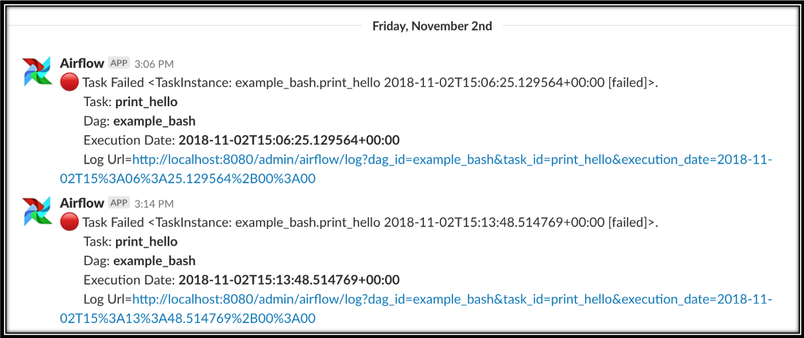

# Alerting

## アラート

[モニタリング](monitoring.md) とアラートを組み合わせることで、データ製品の健全性の全体像を把握できます。

アラートは特定のアクションによってトリガーされます。

- アラートを通知するケースは？
- アラートの送信先は？
- 効果的なメッセージを作成するには？

例えば、実用的なアラートには、パイプラインがいつ、何が、なぜ停止したか（エラーログへのリンク付き）といった、フォローアップアクションの実行に役立つ情報が含まれています:



あらゆる種類のテストとそれに関連するアラートを作成できますが、通常は最初にパイプラインの実行状態に関するアラートを作成します。
残念ながら、パイプラインの結果は2値ではありません。成功する、失敗する、余分なデータのために遅延する、バグのために停止する、依存関係の失敗のために開始されないなど、さまざまな可能性があります。
ケースの複雑さから、通常は失敗をアラートし、[監視](monitoring.md) (成功の欠如) を監視対象とします。

アラートはテスト配信の手段としても使用できます。
たとえば、カスタマーサポート担当者は、各顧客からの通話を顧客に関連付ける必要があります。
すべてのチケットに本番データベース内の顧客が含まれているかどうかをテストできます。
含まれていない場合は、カスタマーサポートに必要な情報を収集するようにアラートを送信できます。

## Sentry

`dlt` [tracing](./tracing.md) を使用すると、[Sentry](https://sentry.io) DSN を構成して、発生したエラーや例外など、実行されたパイプラインに関する豊富な情報を受け取ることができます。

## Slack

Slackの受信Webhook URLを介して、Slackチャンネルにアラートを送信できます。
以下のコードスニペットは、`send_slack_message`関数を使用して、データベーステーブルの更新に関する自動Slack通知を示しています。

```py
# Import the send_slack_message function from the dlt library
from dlt.common.runtime.slack import send_slack_message

# Define the URL for your Slack webhook
hook = "https://hooks.slack.com/services/xxx/xxx/xxx"

# Iterate over each package in the load_info object
for package in load_info.load_packages:
    # Iterate over each table in the schema_update of the current package
    for table_name, table in package.schema_update.items():
        # Iterate over each column in the current table
        for column_name, column in table["columns"].items():
            # Send a message to the Slack channel with the table
            # and column update information
            send_slack_message(
                hook,
                message=(
                    f"\tTable updated: {table_name}: "
                    f"Column changed: {column_name}: "
                    f"{column['data_type']}"
                )
            )
```

本番環境でのこの手法の実践的な適用例については、こちらの[例](../examples/chess_production/)を参照してください。

同様に、Slack通知を拡張して、パイプラインの実行時間、読み込み時間、スキーマの変更などの情報を含めることもできます。
Slackへのメッセージの設定と送信に関する詳細は、[こちら](./running#using-slack-to-send-messages)をご覧ください。

