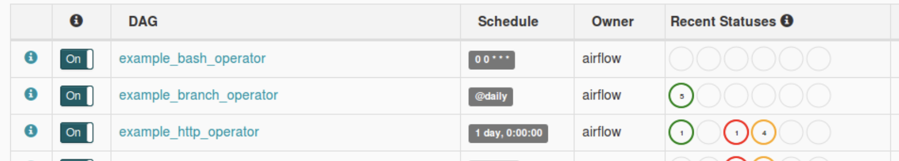
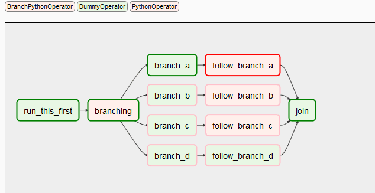
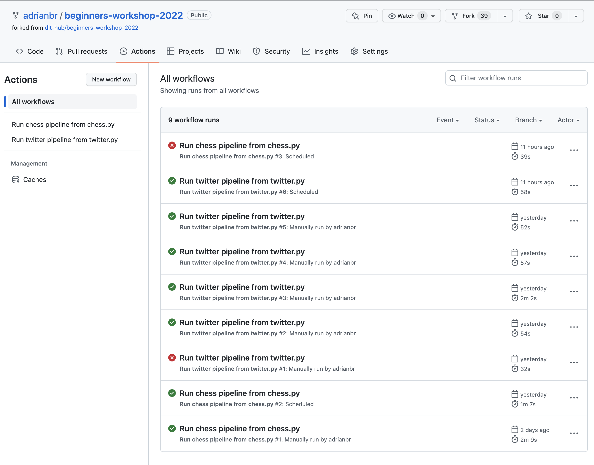
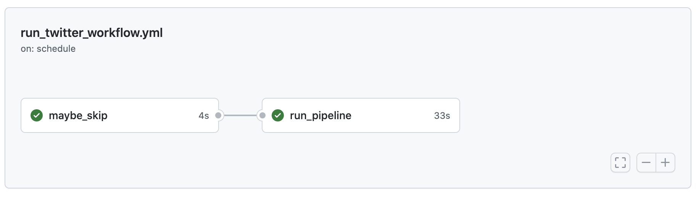

# モニタリング

モニタリングと[アラート](alerting.md)は、データ製品の健全性についてより包括的な情報を提供するために併用されます。
モニタリングでは、アラート時に考慮するよりもはるかに多くの情報を検証します。
モニタリングは、システムの健全性について迅速かつ簡潔な概要を提供することを目的としています。
`dlt`パイプラインを最適にモニタリングする方法は、[デプロイメント方法](../walkthroughs/deploy-a-pipeline/)によって異なります。

## 実行監視

### Airflow

Airflow では、トップレベルで以下の項目を監視できます。

- 実行予定（または実行予定ではない）のタスク。
- 実行履歴（成功/失敗など）。

Airflow DAGs:



Airflow DAG tasks:



### GitHub Actions

GitHub Actions では、トップレベルで以下の項目を監視できます。

- 実行予定（または実行予定ではない）のワークフロー。
- 実行履歴（成功/失敗など）。

GitHub Actions workflows:



GitHub Actions workflow DAG:



### Sentry

`dlt` [tracing](tracing.md) を使用すると、[Sentry](https://sentry.io) DSN を構成して、発生したエラーや例外など、実行されたパイプラインに関する豊富な情報を受け取ることができます。

## データ監視

データ品質監視は、高品質なデータがデータウェアハウスに時間どおりに到着することを保証することを目的としています。アラートではなく監視を行うのは、何が問題になるかを簡単に定義できないためです。

そのため、データ品質を監視する際には、データが正常か、あるいはさらなる調査が必要かを人が判断できるよう、十分なコンテキストを取得する必要があります。

監視の定番は、折れ線グラフと時系列グラフであり、人が解釈できるベースラインやパターンを提供します。

例えば、データの読み込みを監視するには、「`loaded_at` 日時別のレコード数」、「作成時刻」、「変更時刻」、またはその他の最新性マーカーをプロットすることを検討してください。

### 行数

テーブルごとにロードされた行数を確認するには、次のコマンドを使用します:

```sh
dlt pipeline <pipeline_name> trace
```

このコマンドは、ロードされたテーブルの名前と各テーブルの行数を表示します。
上記のコマンドは、Chessソースの行数を表示します。以下のようになります:

```sh
Step normalize COMPLETED in 2.37 seconds.
Normalized data for the following tables:
- _dlt_pipeline_state: 1 row(s)
- payments: 1329 row(s)
- tickets: 1492 row(s)
- orders: 2940 row(s)
- shipment: 2382 row(s)
- retailers: 1342 row(s)
```

この情報を宛先に再度読み込むには、以下を使用できます:

```py
# Create a pipeline with the specified name, destination, and dataset
# Run the pipeline

# Get the trace of the last run of the pipeline
# The trace contains timing information on extract, normalize, and load steps
trace = pipeline.last_trace

# Load the trace information into a table named "_trace" in the destination
pipeline.run([trace], table_name="_trace")
```

このプロセスでは、複数の追加テーブルが出力先にロードされ、抽出、正規化、ロードの各ステップに関する詳細な情報が得られます。各テーブルにロードされた行数と `load_id` に関する情報は、`_trace__steps__extract_info__table_metrics` テーブルで確認できます。
`load_id` は、ロードが完了した時刻を示すエポックタイムスタンプです。
以下は、異なるテーブルに `load_id` でロードされた行をグラフィカルに表したものです。


### Data load time

各テーブルのデータ読み込み時間は、次のコマンドを使用して取得できます:

```sh
dlt pipeline <pipeline_name> load-package
```

上記の情報は、次のようにスクリプトから取得することもできます:

```py
info = pipeline.run(source, table_name="table_name", write_disposition='append')

print(info.load_packages[0])
```
> `load_packages[0]`はロードパッケージのリストの最初のロードパッケージの情報を出力します。

