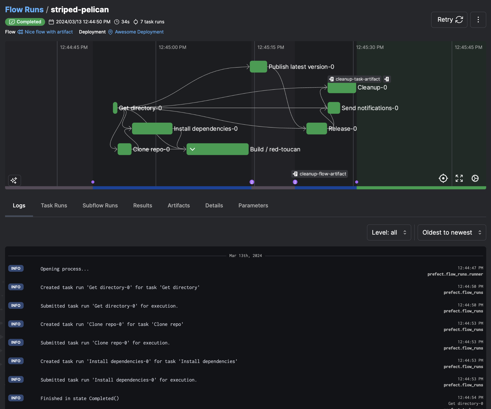
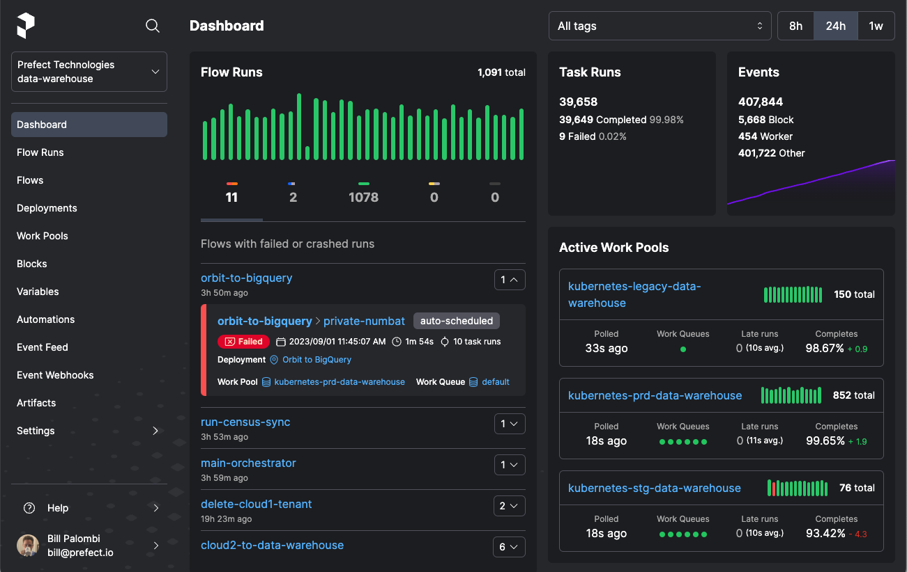

# Prefectでデプロイ

## Prefect の紹介

Prefect は、データパイプラインを自動化およびオーケストレーションするワークフローオーケストレーションおよび可観測性プラットフォームです。
オープンソースプラットフォームとして、依存関係を持つタスクの定義、スケジュール設定、実行のためのフレームワークを提供します。
Prefect により、ユーザーはデータワークフローを効率的に監視、維持、拡張できます。



### Prefect の機能

- **フロー**: フローにはワークフローロジックが含まれており、Python 関数として定義されています。
- **タスク**: タスクは個別の作業単位を表します。タスクを使用すると、フローやサブフローで再利用できるワークフローロジックをカプセル化できます。
- **デプロイメントとスケジュール**: デプロイメントは、ワークフローを手動で呼び出される関数から、リモートからトリガーできる API 管理エンティティに変換します。Prefect では、スケジュールを使用して、デプロイメントの新しいフロー実行を自動的に作成したり、イベントに基づいて新しい実行をトリガーしたりできます。
- **オートメーション**: Prefect Cloud では、[トリガー](https://docs.prefect.io/latest/concepts/automations/#triggers) に基づいて Prefect が自動的に実行する [アクション](https://docs.prefect.io/latest/concepts/automations/#actions) を設定できます。
- **キャッシュ**: この機能により、タスクを定義するコードを実際に実行することなく、完了した状態を反映できます。
- **可観測性**: この機能により、ユーザーはワークフローとタスクを監視できます。ログ、メトリクス、通知を通じて、データパイプラインのパフォーマンスと動作に関する洞察が得られます。

## `dlt` を使ったデータパイプラインの構築

`dlt` は、スキーマの自動推論と進化により、データソースを適切に構造化されたテーブルまたはデータセットに宣言的にロードすることを可能にするオープンソースの Python ライブラリです。
完全な抽出とロードのプロセスをサポートする機能を提供することで、データパイプラインの構築を簡素化します。

### **`dlt`** は、パイプラインのオーケストレーションのために Prefect とどのように統合するのでしょうか？

ここでは、「Slack データを BigQuery に移動する」を例に、Prefect を使用して `dlt` パイプラインをオーケストレーションするための簡潔なガイドをご紹介します。包括的なステップバイステップガイドは、記事「dlt + Prefect で数分で耐障害性の高いデータパイプラインを構築する」](https://www.prefect.io/blog/building-resilient-data-pipelines-in-minutes-with-dlt-prefect) と、対応する GitHub リポジトリ [こちら](https://github.com/dylanbhughes/dlt_slack_pipeline/blob/main/slack_pipeline_with_prefect.py) でご覧いただけます。

### 実行した手順の概要は次のとおりです。

1. `dlt` パイプラインを作成します。パイプラインの作成手順の詳細については、[ドキュメント](../create-a-pipeline) を参照してください。

1. 個々の関数に `@task` デコレータを追加します。
    1. ここでは、`get_users` 関数に `@task` デコレータを使用します。
        
        ```py
        @task
        def get_users() -> None:
            """Execute a pipeline that will load the Slack users list."""
        ```
        
    1. `slack_pipeline` 関数で `@flow` 関数を次のように使用します。
        
        ```py
        @flow
        def slack_pipeline(
            channels=None, 
            start_date=pendulum.now().subtract(days=1).date()
        ) -> None:
            get_users()
        
        ```
        
2. 最後に、`if __name__ == '__main__'` ブロックに `.serve` を追加して、毎日実行するための Prefect デプロイメントを自動的に作成してスケジュールします。
    
    ```py
    if __name__ == "__main__":
        slack_pipeline.serve("slack_pipeline", cron="0 0 * * *")
    ```
    
3. [PrefectUI](https://app.prefect.cloud/auth/login) を使用すると、デプロイの詳細とスケジュールされた実行（成功と失敗を含む）を確認できます。これにより、パイプラインがいつ実行されたか、そしてさらに重要な点として、いつ実行されなかったかを把握できます。



パイプラインをさらに拡張するには、次の方法があります。

- [ワーカーを使用したリモートインフラストラクチャ](https://docs.prefect.io/latest/tutorial/workers/?deviceId=bb3e22c1-c2c7-4981-bd5e-c81715503e08)を設定します。
- [自動化を追加](https://docs.prefect.io/latest/concepts/automations/?deviceId=bb3e22c1-c2c7-4981-bd5e-c81715503e08)して、パイプラインの実行ステータスを通知します。
- [再試行の設定](https://docs.prefect.io/latest/concepts/tasks/?deviceId=bb3e22c1-c2c7-4981-bd5e-c81715503e08#custom-retry-behavior)。

